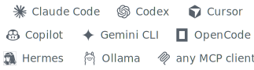
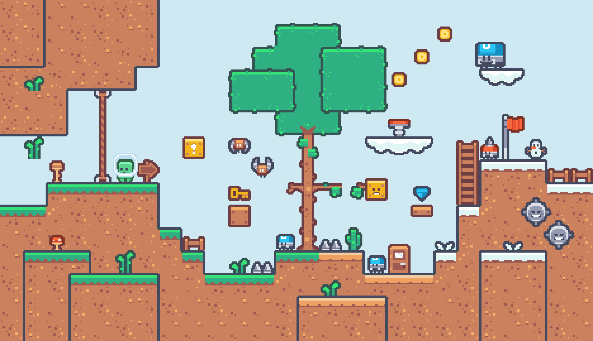
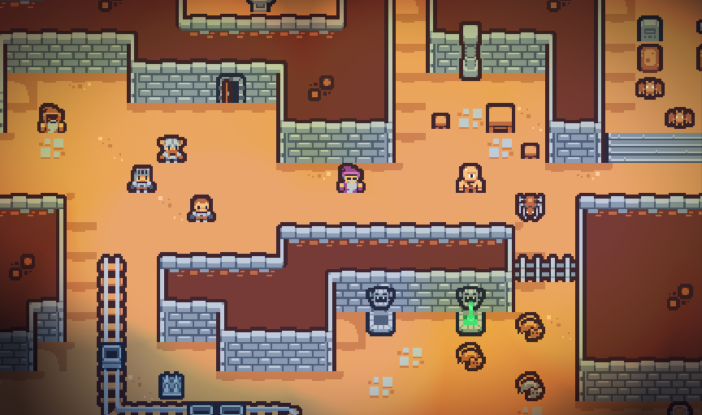
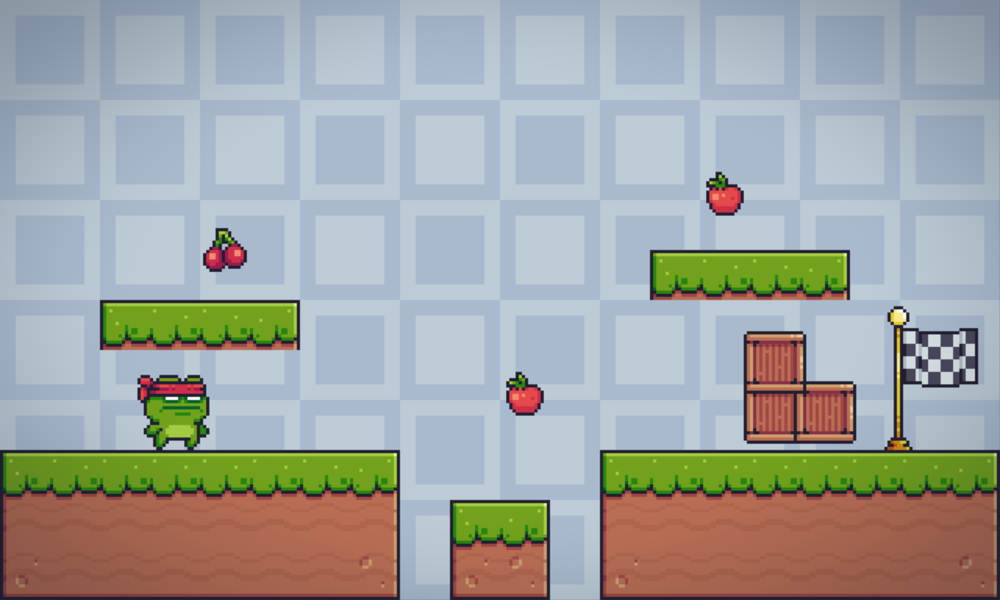
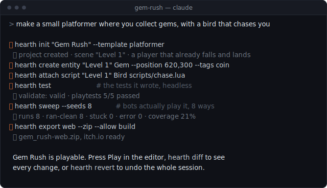
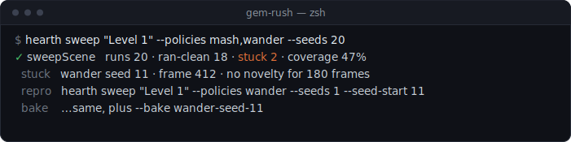

<div align="center">

<picture>
  <source media="(prefers-color-scheme: dark)" srcset="assets/brand/readme-banner-dark.svg">
  
</picture>

### The 2D game engine your coding agent can actually drive

A real editor for you. The whole engine as typed, validated commands for your agent,
plus a headless bot that plays the game to check the change actually works.

[Download](https://github.com/echoo19/hearth/releases/latest) · [Quickstart](docs/quickstart.md) · [Docs](#documentation) · [Website](https://hearthengine.com) · [Feedback](https://hearthengine.com/feedback)

[](https://github.com/echoo19/hearth/actions/workflows/ci.yml)
[](https://github.com/echoo19/hearth/releases/latest)
[](LICENSE)

<br>

**Works with**

<picture>
  <source media="(prefers-color-scheme: dark)" srcset="assets/brand/works-with-dark.svg">
  
</picture>

**Your agent. No subscription.**

<br>





<sub>Any game you can imagine. Art: <a href="https://kenney.nl">Kenney</a> and
<a href="https://pixelfrog-assets.itch.io">Pixel Frog</a> (CC0).</sub>

</div>

---

## Just say "make a game"

Point one of those agents at an empty folder and ask for a game. The editor has a
terminal built into it (the Agent panel), or use your own:



None of that is a chat box wrapped around a game template. Each line is a real
command with a schema behind it, and each one is also an MCP tool, an editor
action, and an entry in a journal on disk.

## The flagship: the engine plays your game

An agent will happily tell you the level works. `hearth sweep` makes it check.
Seeded bots play a scene headlessly at full speed, using mash, idle, wander, or
seek policies, and report back what crashed, softlocked, got stuck, or turned
out to be unreachable.



The runtime is deterministic, so seed 11 fails the same way every time you run
it, and `--bake` freezes that run into a permanent scripted regression test. It
means your agent can show you the game still works instead of telling you. More
in [docs/playtesting.md](docs/playtesting.md).

Feel is checkable too: motion asserts turn "the jump peaks at 120px, settles by
frame 18" into a test, not an opinion. See [docs/game-feel.md](docs/game-feel.md).

## The rest of the idea, briefly

- **Your agent already knows how to use it.** Commands with real schemas over
  CLI and MCP, plus a per-project skill that teaches it the loop before it
  touches anything. No file format to guess at.
- **You stay in charge.** Snapshot, review a structural diff, revert the whole
  session if you want. Permission modes gate what agents may touch, and every
  command is journaled to disk.
- **The engine works without AI.** A full 2D engine and a dockable editor you
  can work in all day. Agents are a first-class client, never a dependency.
- **Your project is just files.** Readable JSON, plain Lua or JavaScript, your
  own art, on your own disk. MIT licensed.

```
   Human ──▶ Editor UI ──┐
                         ├──▶  one shared command system  ──▶  project files
   Agent ──▶ CLI / MCP ──┘      (validate · execute · diff)     scenes · scripts · assets
```

## Get started

No build step. Download the [desktop app](https://github.com/echoo19/hearth/releases/latest)
(macOS/Windows/Linux), or grab the two standalone agent files (Node 20+):

```bash
curl -LO https://github.com/echoo19/hearth/releases/latest/download/hearth-cli.mjs
curl -LO https://github.com/echoo19/hearth/releases/latest/download/hearth-mcp.mjs
```

Scaffold a playable starter with `hearth init "Star Catcher" --template platformer`,
open it, and point your agent at the Agent panel (`hearth` is already on PATH).
Then just describe the game. When it's done, press **Play** and
`hearth export web --zip` for an itch.io build or `hearth export desktop` for a
native app.

The [Quickstart](docs/quickstart.md) has the full ten-minute walkthrough, and
there are per-agent setup guides for [Claude Code](docs/connect-claude-code.md),
[Codex](docs/connect-codex.md), [OpenCode + Ollama](docs/connect-opencode.md),
[Hermes](docs/connect-hermes.md), and [any MCP client](docs/connect-any-agent.md).

## What's in the engine

A real 2D engine, not a toy. The short version, with the detail one link away:

- **Runtime.** Deterministic, fixed-timestep: sprites, tilemaps with
  autotiling, 2D lighting, particles, animation state machines, a post-processing
  stack, physics, gamepad input, and game UI. Runs identically in the editor,
  headless, and in exports. [Effects](docs/effects.md) · [Components](docs/components.md)
- **Scripting.** Lua or JavaScript against one `ctx` API, sandboxed and
  seed-deterministic, with hot-reload. [Scripting](docs/scripting.md)
- **Editor.** A dockable workspace with a scene view, typed inspector, asset
  pipeline, live preview, and an embedded terminal for your agent that
  auto-follows external edits. [Editor](docs/editor.md) · [Agent panel](docs/agent-panel.md)
- **Agent tooling.** Every command over CLI and MCP with JSON output,
  permission modes, and schema-checked writes. Headless playtests and
  `hearth screenshot` let an agent check its own work. [CLI](docs/cli.md) · [MCP](docs/mcp.md)
- **Bot playtesting.** `hearth sweep` sends seeded bots through a scene to find
  crashes, softlocks, and dead ends; `--bake` freezes a failure into a
  regression test. [Playtesting](docs/playtesting.md)
- **Prefabs and export.** Reusable live-linked templates, and self-contained web
  or native builds with none of Hearth's chrome in them.
  [Prefabs](docs/prefabs.md) · [Export](docs/export.md)

Hearth is at **v1.1.0**, a production release. The whole loop works end to end;
the [roadmap](docs/roadmap.md) tracks what's next.

## Install

**Desktop app.** Grab it from the
[latest release](https://github.com/echoo19/hearth/releases/latest): macOS
(`Hearth-mac-arm64.dmg` / `Hearth-mac-x64.dmg`), Windows
(`Hearth-win-x64.exe`), Linux (`Hearth-linux-x86_64.AppImage` /
`Hearth-linux-amd64.deb`). macOS builds are signed with a Developer ID and
notarized by Apple, so they open normally; Windows is not code-signed yet, so
SmartScreen shows a "More info → Run anyway" prompt on first launch. After that
the app updates itself from later releases. See
[docs/desktop-app.md](docs/desktop-app.md).

**Agent tools, no install.** The CLI and MCP server are single files that only
need Node 20+ (also bundled inside the desktop app):

```bash
curl -LO https://github.com/echoo19/hearth/releases/latest/download/hearth-cli.mjs
curl -LO https://github.com/echoo19/hearth/releases/latest/download/hearth-mcp.mjs
node hearth-cli.mjs --help
claude mcp add hearth -- node $PWD/hearth-mcp.mjs --project <your game>
```

The loop an agent runs (snapshot, inspect, edit, validate, test, sweep, diff,
revert) is pleasant to run by hand too. [The CLI guide](docs/cli.md) walks
through it; permission modes ([MCP guide](docs/mcp.md)) control what an agent may
touch.

## Documentation

Organized as a journey: get started, build, script, ship, connect an agent,
reference.

| | |
| --- | --- |
| **Get started** | |
| [Quickstart](docs/quickstart.md) | Install → first game in ten minutes |
| [Desktop app](docs/desktop-app.md) | Electron packaging, native folder dialogs |
| [Editor guide](docs/editor.md) | Chrome, shortcuts, transform handles, Code/Live/Animator panels |
| **Build** | |
| [Components](docs/components.md) | All component types and their defaults |
| [Prefabs](docs/prefabs.md) | Reusable templates, live-link merge sync, `ctx.scene.spawnPrefab` |
| [Assets](docs/assets.md) | Import (incl. bulk/folder), spritesheets, animations, music, fonts |
| [Effects](docs/effects.md) | `Camera.postEffects`, `SpriteEffects`, determinism |
| [Input](docs/input.md) | Actions, keyboard, gamepad, virtual axes |
| [UI](docs/ui.md) | Widgets, layout, focus navigation |
| **Script** | |
| [Scripting](docs/scripting.md) | Lua and JS, the full `ctx` API, animation state machines |
| **Prove it** | |
| [Playtesting](docs/playtesting.md) | Scripted playtests, bot sweeps, objectives, `--bake` |
| [Game feel](docs/game-feel.md) | Making it feel good, and measuring that it does |
| **Ship** | |
| [Export](docs/export.md) | Web (static/single-file) and desktop (Electron, signing) builds |
| [Hosting a web build](docs/ship-web-hosting.md) | Your own domain, static hosts, iframe embeds |
| [Shipping to itch.io](docs/shipping-to-itch.md) | Web zip upload, desktop channel zips, butler |
| [Distributing a desktop game](docs/ship-desktop.md) | Unsigned-build honesty: Gatekeeper, SmartScreen, signing |
| **Agents** | |
| [Agent panel](docs/agent-panel.md) | Embedded terminal, subscription safety, external-change model |
| [Agent workflow](docs/agents.md) | How agents should operate, and why |
| [CLI guide](docs/cli.md) | Every command, plus the JSON envelope |
| [MCP guide](docs/mcp.md) | Connecting agents, permission modes |
| [Connect Claude Code](docs/connect-claude-code.md) | Project shell + manual MCP setup |
| [Connect Codex](docs/connect-codex.md) | `codex mcp add`, `config.toml` |
| [Connect OpenCode + Ollama](docs/connect-opencode.md) | Local models, end to end |
| [Connect Hermes](docs/connect-hermes.md) | Running a Hermes model against Hearth |
| [Connect any agent](docs/connect-any-agent.md) | Canonical MCP config + shell-only loop |
| **Reference** | |
| [Project format](docs/project-format.md) | Every file, every schema |
| [Architecture](docs/architecture.md) | Packages, command system, data flow |
| [Performance](docs/performance.md) | Benchmark harness, published numbers |
| [Roadmap](docs/roadmap.md) | What's next, and what's honestly missing |
| [Contributing](CONTRIBUTING.md) | Dev setup and the AI contribution policy |
| [Feedback](https://hearthengine.com/feedback) | Report a bug, request a feature, ask a question |

## Design principles

1. **The engine works without AI.** Agents are a first-class client, but
   nothing in the engine depends on them.
2. **One command system.** If it isn't a registered command, neither the UI
   nor agents can do it, so capabilities stay legible and auditable.
3. **Humans stay in charge.** Permission modes gate what agents may touch,
   snapshots and structural diffs make every agent session reviewable and
   revertible, and playtests make "it works" checkable.
4. **Local-first, readable files.** Projects are JSON you can diff, art you can
   open in anything, and plain Lua or JavaScript scripts.

## Contributing & building from source

Requires Node 20+.

```bash
git clone https://github.com/echoo19/hearth.git && cd hearth
npm install
npm run build:packages     # core → runtime → playtest → shipping → templates → cli → mcp-server
npm test                   # full suite, headless
npm run typecheck          # vitest does not typecheck; run this too
npm run dev                # editor at http://localhost:5173
```

Open an example from the launcher (try **Mini Platformer**) and press **Play**
(arrows/WASD to move, Space to jump). For the desktop app, `npm run app`
launches it and `npm run app:dist` packages an installer; see
[docs/desktop-app.md](docs/desktop-app.md). Eleven example projects live in
`packages/examples`, every one generated through the command system itself and
covered by playtests in CI. They double as reference projects for everything
the docs describe. Ground rules and the AI contribution policy are in
[CONTRIBUTING.md](CONTRIBUTING.md).

## License

[MIT](LICENSE). Dependencies are all open-source-friendly: zod, commander,
PixiJS, React, wasmoon, and the MCP SDK.
