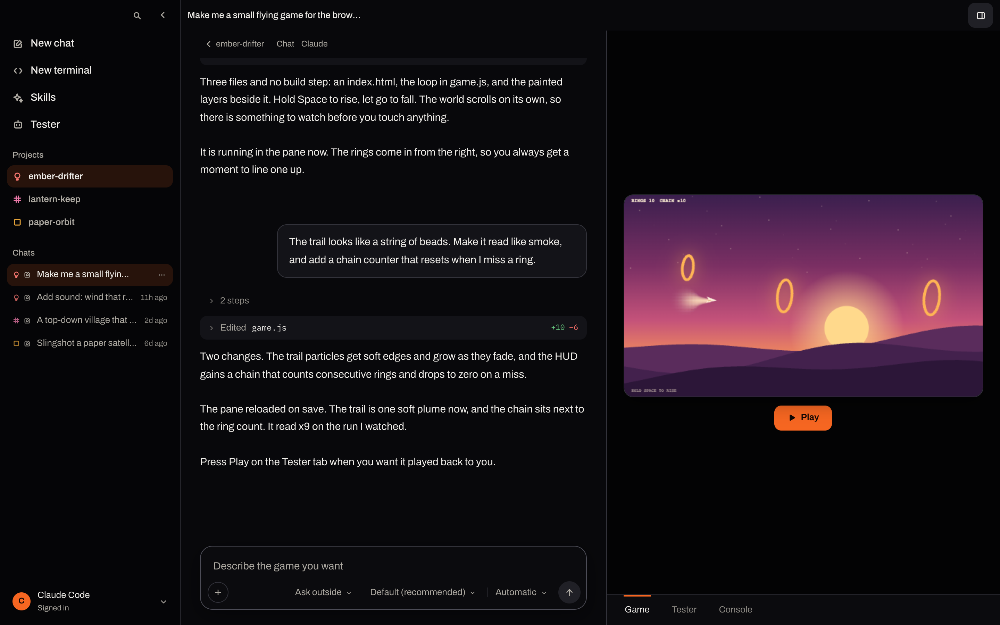

<picture>
  <source media="(prefers-color-scheme: dark)" srcset="assets/brand/readme-banner-dark.svg">
  
</picture>

### The app for open-ended agentic game dev

[Download](https://hearthengine.com/download) · [Quickstart](docs/quickstart.md) · [How it works](https://hearthengine.com/how-it-works) · [Feedback](https://hearthengine.com/feedback)

The current release is v1.7.0, for macOS, Windows, and Linux.

## What it is

Type what you want to play. A coding agent builds it, and the game appears in
the pane next to the conversation and keeps running while the agent works. Ask
for a change and watch it land, rather than reading a summary of it.

There is no project format and no engine to learn. The agent writes plain
files into a folder on your computer, using whatever it thinks fits, and
anything that runs in a browser runs in the pane. Your game never has to know
Hearth exists.

And the agent is whichever one you already pay for.

## A playtester who remembers

Every project gets one. It plays your game itself, in its own browser, and
keeps notes on what it found. Before it plays again it reads those notes back.
So it does not arrive blank each time. It arrives knowing where it got stuck
last week, and goes to see whether you fixed it.

That memory is what lets it answer the question you actually ask after every
change, and the one nothing without a history can: **did that help?**

Here is a real session, the second one it played on a small platformer, after
the jump height went up:

> **It says your last change helped.**
>
> *What it thought you changed.* The player's jump height was changed.
>
> *Why it says that.* This time I saw the score reach 1 on picture 3, while
> last time I never collected any coins.
>
> *Anything worse.* Nothing got worse.
>
> *Still could not work out.* I could not work out how to reliably land on the
> first platform.

Every claim is pinned to the frame it happened on, so you can go and look. Its
memory is a plain markdown file in your project, so when it gets something wrong
about your game you open it and fix the line. Its old sessions never get
rewritten, so you can catch it changing its mind.

It is not a good player and it will not pretend to be. Anything that wants
reflexes will beat it, and what it writes down is what it tried and where it
failed, never a claim that it finished. It will not tell you whether your game
is fun either. That part is still yours.

It plays only when you ask, and each turn runs on your own model quota. Even
when you stop it mid-session, it still writes the note. More in
[docs/tester.md](docs/tester.md).

## Bring your own agent

**Claude.** Hearth runs the Claude Code you are signed into, so an API key is
optional. You pick the model in the composer, and switching mid-chat takes
effect on your next message. There is also a per-turn effort dial for when a
change deserves more or less thought.

**ChatGPT.** Hearth talks to the open-source
[Codex CLI](https://github.com/openai/codex) you installed, and Codex holds
the sign-in. Models come live from the binary, reasoning effort included.

**Anything else.** The sidebar has a terminal beside the chat: a real shell,
opened in the project folder, with the hearth tools on PATH. Run whatever
agent CLI you like, and the pane keeps up because Hearth watches the folder
either way.

Conversations survive, too. A chat keeps the agent's working memory across app
restarts and disconnects, and stopping a turn pauses the conversation rather
than ending it. Setup, attachments, skills, and approvals are in
[docs/agents.md](docs/agents.md).

## Your files, your folder, no lock-in

Every project is an ordinary folder under `~/Hearth`. Move it, back it up, open
it in any editor, put it on GitHub, or walk away from Hearth entirely and take
the game with you. Nothing lives in a database or in the cloud, and there is
nothing to export because it was never trapped anywhere.

Your conversations sit in there too, so the history of how the game got made
travels with the project. Hearth's own bookkeeping stays in a `.hearth` folder
that is kept out of your git history automatically.
[docs/projects-and-chats.md](docs/projects-and-chats.md) has the layout.

## Going deeper

- [docs/probe-shim.md](docs/probe-shim.md): a game can name its entities and actions for the tester through one small file it owns. It is an offer, and a game that says nothing is a first-class game.
- [docs/mcp.md](docs/mcp.md) and [docs/cli.md](docs/cli.md): the probe is also an MCP server and a CLI for agents working outside the app.
- [docs/connect-your-engine.md](docs/connect-your-engine.md): games that do not run in a browser.
- [docs/roadmap.md](docs/roadmap.md) and [docs/architecture.md](docs/architecture.md): what's next, and how the app fits together.
- Hearth used to be a 2D game engine. That engine is preserved on the [`engine-v1`](https://github.com/echoo19/hearth/tree/engine-v1) branch (final release [v1.2.1](https://github.com/echoo19/hearth/releases/tag/v1.2.1)) and no longer developed.

## Contributing and license

Dev setup, ground rules, and the AI contribution policy are in
[CONTRIBUTING.md](CONTRIBUTING.md). Hearth is free and open source under the
[MIT license](LICENSE).
